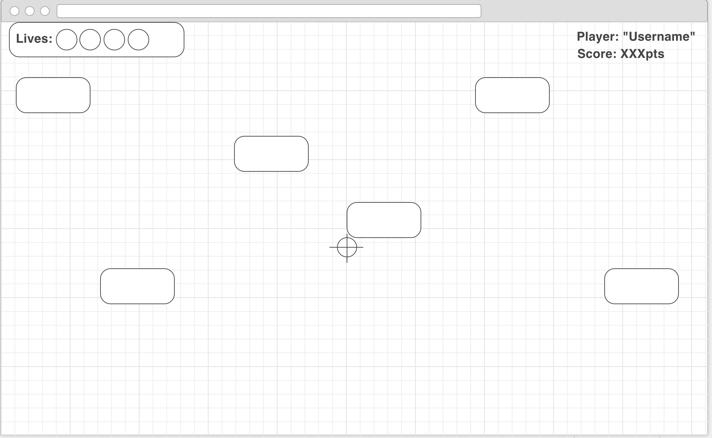

Futurama: Omicronian Invasion

Wireframe:

Approach taken:  
I started my project by creating the base html and css to get some visual going creating a life bar, a score, background, and a single spaceship on screen. From there I created a javascript file and used jQuery to get the single ship to "spawn" offscreen then "fly" across the screen. After getting the ship to fly I then focused on adding an event listener to get the ship to explode when clicked on by changing the img to an explosion. Then from there the img would fade out and then the div containing the ship would then be deleted from the html so that the html file will not be cluttered by all the ships that have spawned. Then the next task was to get the score counter to increase every time you killed a ship. After getting that to work for the single ship the next task was to get ships to continually spawn until your lives ran out. After solving the code for that I then figured out how to get each ship to spawn in a random height location as well as adding random speeds to the ships. The final task a went after was to get a screen to pop up after you lose with a button to restart the game.

Unsolved problems: 
One problem I encountered was getting only the ship you click to explode, instead every ship on screen explodes when one is clicked. 
Another problem I did not solve was the score counter is increasing in the wrong increments when a ship is killed. 
The final problem with my game is that the ships do not stop spawning after you lose. 
I believe if I had a little more time I could figure out and fix these problems.

Future features: 
I would like to go back to this game in the future and add multiple features. I would like to have it so that there are levels and as the levels go on the ships will start getting faster and more ships will spawn at the same time to make it harder the further in the game you make it. and each level will have a target number of ships you have to kill to move onto the next level.  
